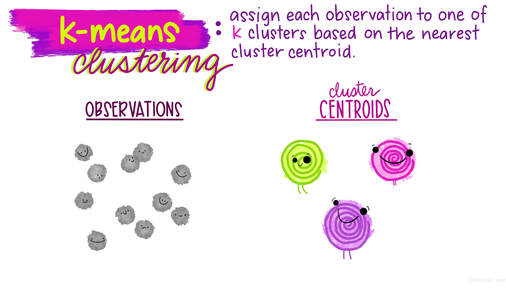
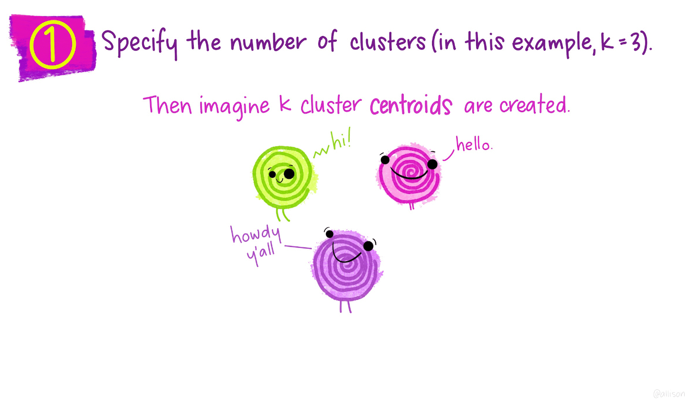
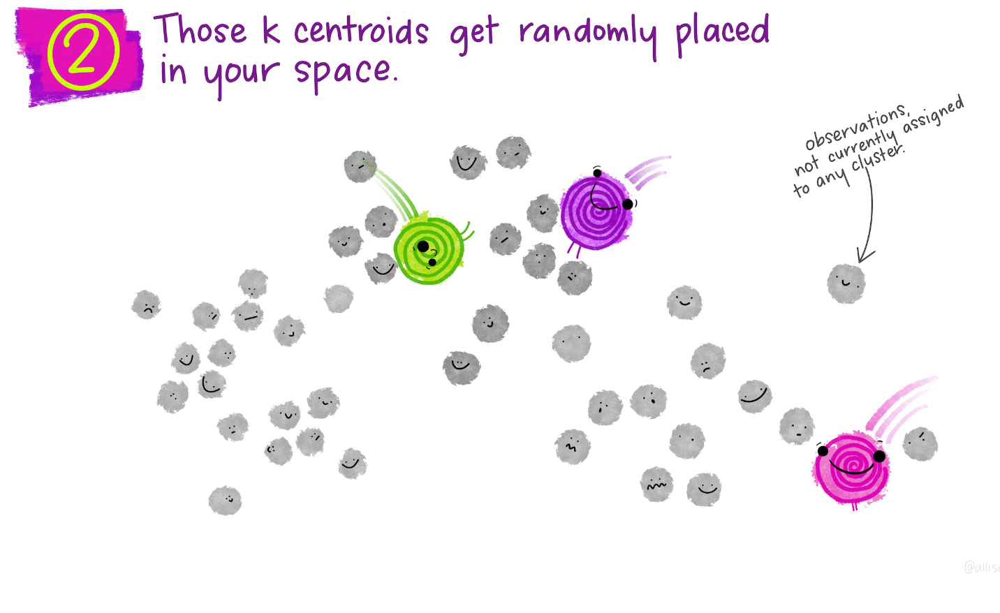
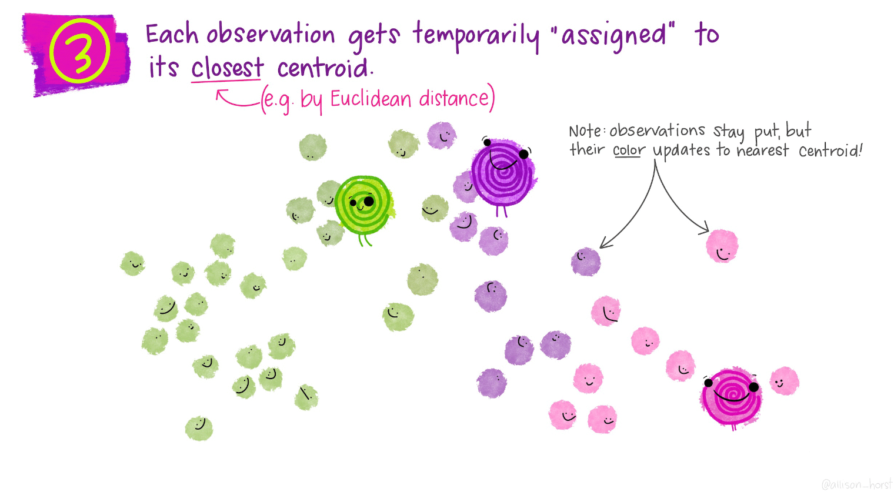
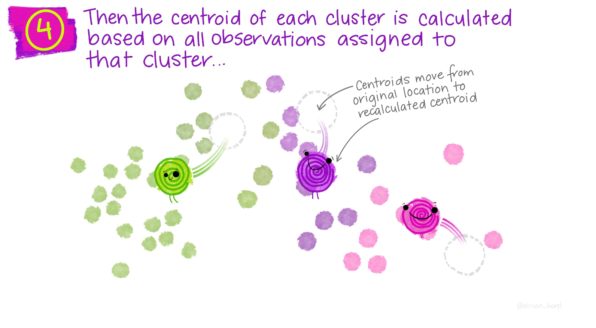
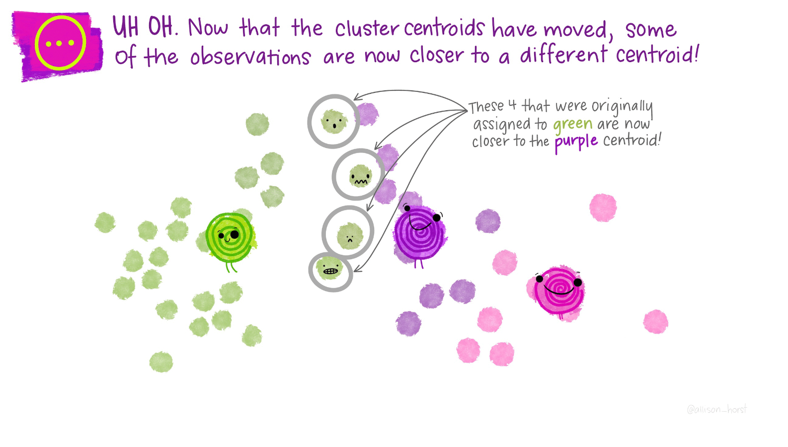
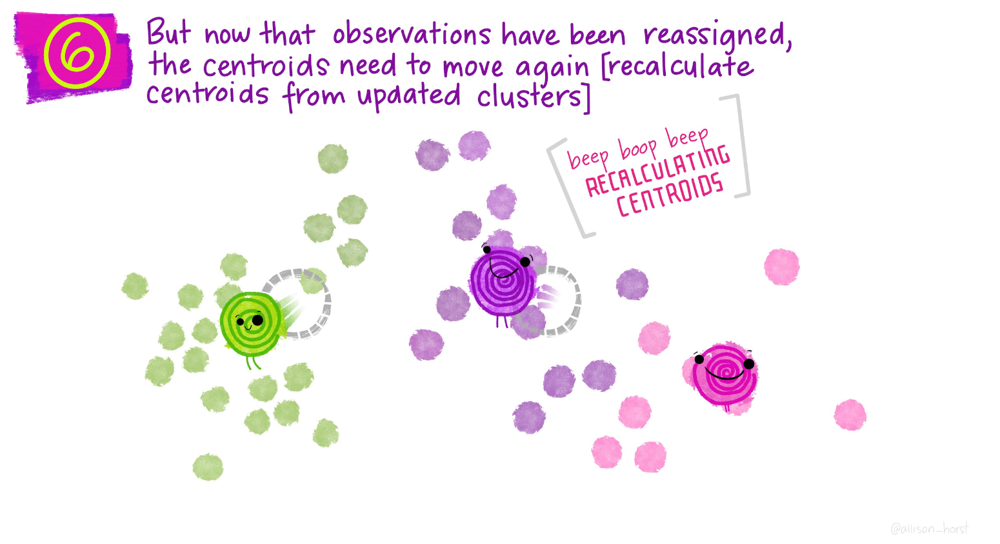
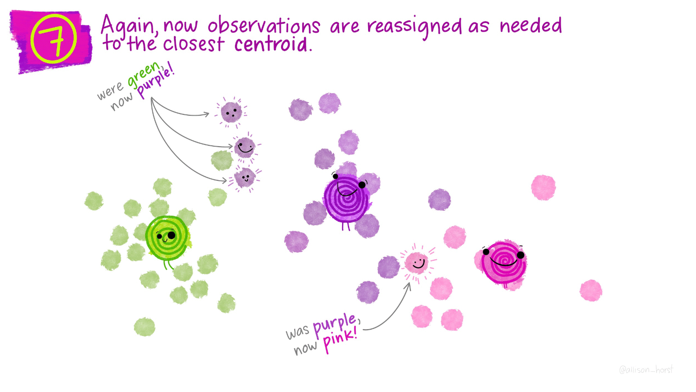

# Clustering {#clustering}

These are my notes from the tutorial on k-means clustering in the tidymodels framework. The code comes from RStudio. The RStudio website also has some really nice pictures by Allison Horst for this process so I stole those as well.

## Quick description

How does this algorithm work?

We start with a random set of two dimensional data points. Assume we want to group this data into three classes. Begin by randomly guessing where the centroid of each of the three sets is. Then classify each point as belonging to the class of the centroid nearest it. Next recalculate the centroid for each cluster. Again classify each point based on it's nearest centroid, then recalculate the centroid. Repeat.

## In pictures

Thank you to Allison Horst for drawing these. 


















## In R

To see how this looks in R, load the tidymodels libraries.

```{r}
library(tidymodels)
```


Create the fake data. We will have three clusters.

```{r}
set.seed(27)

centers <- tibble(
  cluster = factor(1:3), 
  num_points = c(100, 150, 50),  # number points in each cluster
  x1 = c(5, 0, -3),              # x1 coordinate of cluster center
  x2 = c(-1, 1, -2)              # x2 coordinate of cluster center
)
```

Now generate the points. This is a great trick here where we apply the `rnorm` function using `{purr}` to create a nested data frame. We then drop the input (`num_points`) that we used to generate the data, unnest, and viola, a data frame with data labeled in clusters. I like this a lot.

```{r}
labelled_points <- 
  centers %>%
  mutate(
    x1 = map2(num_points, x1, rnorm),
    x2 = map2(num_points, x2, rnorm)
  ) %>% 
  select(-num_points) %>% 
  unnest(cols = c(x1, x2))

ggplot(labelled_points, aes(x1, x2, color = cluster)) +
  geom_point(alpha = 0.3)
```

```{r}
points <- 
  labelled_points %>% 
  select(-cluster)

kclust <- kmeans(points, centers = 3)
kclust
```


