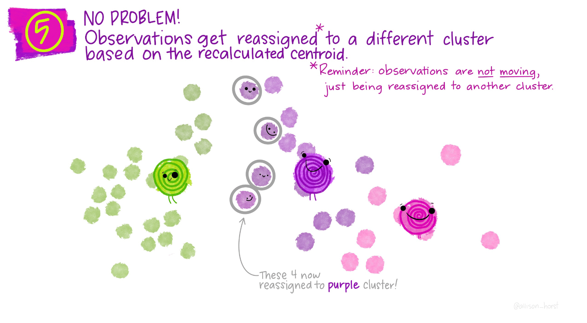
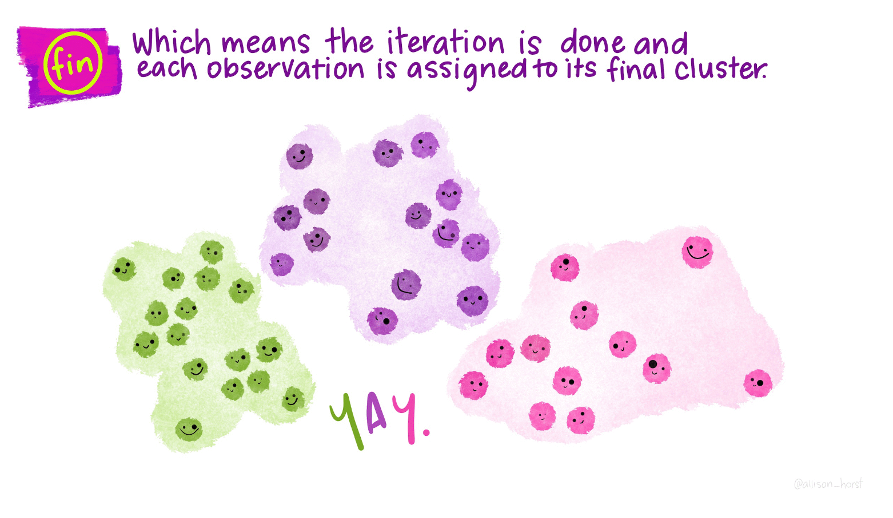

# Clustering {#clustering}

These are my notes from the tutorial on K-means clustering in the tidymodels framework. They have some really nice pictures by Allison Horst for this process so I stole them.

## Quick description

How does this algorithm work?

Suppose we start with a random set of two dimensional data points. Also assume that we want to group this data into three classes. We would randomly guess where the centroid of each of the three sets was. Then we could classify each point as belonging to the the class of the centroid nearest it. Then we recalculate the centroids. We again classify each point based on it's nearest centroid point, then recalculate the centroid. 

## In pictures

Thank you to Allison Horst for drawing these. 







## In R

To see how this looks in R, let's load the tidymodels libraries.

```{r}
library(tidymodels)
```


Create the fake data. We will have three clusters.

```{r}
set.seed(27)

centers <- tibble(
  cluster = factor(1:3), 
  num_points = c(100, 150, 50),  # number points in each cluster
  x1 = c(5, 0, -3),              # x1 coordinate of cluster center
  x2 = c(-1, 1, -2)              # x2 coordinate of cluster center
)
```

Now we generate the points. This is a great trick here where we apply the `rnorm` function using `{purr}` to create a nested data frame. We then drop the input (*num_points*) that we used to generate the data, and unnest. Viola, a data frame with data labeled in clusters. I like this a lot.

```{r}
labelled_points <- 
  centers %>%
  mutate(
    x1 = map2(num_points, x1, rnorm),
    x2 = map2(num_points, x2, rnorm)
  ) %>% 
  select(-num_points) %>% 
  unnest(cols = c(x1, x2))

ggplot(labelled_points, aes(x1, x2, color = cluster)) +
  geom_point(alpha = 0.3)
```

```{r}
points <- 
  labelled_points %>% 
  select(-cluster)

kclust <- kmeans(points, centers = 3)
kclust
```


